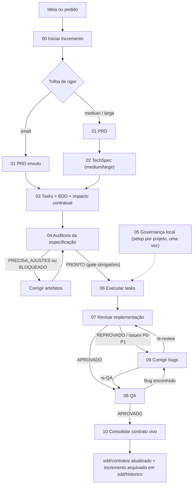

# SDD Template para Compozy + Contratos Vivos

Este repositório é um template para conduzir desenvolvimento orientado por
especificação com agentes de IA, BDD e Compozy.

Em termos simples: antes de pedir para um agente sair programando, este fluxo
obriga o projeto a explicar o que será entregue, por que será entregue, como
será implementado, como será testado, como será revisado e como o conhecimento
final voltará para a documentação viva do sistema.

## A Ideia Em Uma Frase

Cada entrega nasce como um `incremento`, vira tasks executáveis pelo Compozy,
passa por auditoria, implementação, review, QA e bugfix, e no final atualiza o
`contrato vivo` do sistema.

## Para Quem Serve

Use este template quando você quer que agentes trabalhem com previsibilidade em
um projeto real: regras de negócio que não podem ser interpretadas livremente,
contratos entre backend e frontend, rastreabilidade de requisito até teste,
auditoria antes de implementar, QA depois de implementar e documentação viva
que não fica desatualizada.

Para uma alteração muito pequena, o fluxo pode ser enxuto (trilha `small`).
Para uma feature grande, o fluxo completo evita que a IA implemente algo certo
do jeito errado. As trilhas de rigor (`small`, `medium`, `large`) são
escolhidas no passo `00`.

Nunca trabalhou com SDD ou contratos vivos? Comece pelo
[guia para leigos](docs/guia-para-leigos.md) — analogias, uma entrega narrada
do começo ao fim e perguntas de iniciante.

## Conceitos

### Contrato Vivo

O contrato vivo é a descrição versionada do comportamento atual do sistema,
organizada por domínio em `sdd/contratos/[dominio]/contrato.md`. Pense nele
como o manual oficial do que o sistema promete fazer hoje:

```text
O sistema faz isto hoje.
Quando acontece X, deve responder Y.
Quando o usuário tenta Z, deve ver W.
```

Ele não é plano futuro: representa o que já foi consolidado. Ele só é alterado
no fechamento do incremento (passo `10`). Durante a entrega, mudanças de
comportamento são planejadas como `impacto contratual`
(`sdd/incrementos/[feature]/impacto-contratual/`), classificadas como `NOVO`,
`ALTERADO` ou `REMOVIDO`.

### Incremento

Um incremento é uma entrega em andamento. Ele fica em
`sdd/incrementos/[feature]/` e guarda o contexto completo: intenção, execução,
impactos no contrato vivo e relatório de fechamento. O `incremento.yaml` é a
ficha da entrega e carrega o `status` do ciclo de vida (`proposto` →
`especificado` → `em_execucao` → `consolidado`, com `bloqueado` possível em
qualquer etapa — ver `_comum.md`).

### PRD

PRD significa Documento de Requisitos de Produto. Ele fica em
`.compozy/tasks/[feature]/_prd.md` e explica a entrega do ponto de vista de
produto: problema, usuário, valor, regras de negócio, requisitos e fora de
escopo. Obrigatoriedade de PRD/TechSpec por trilha: ver `_comum.md`.

### Incremento Vs PRD

Incremento e PRD não são a mesma coisa. O jeito mais simples de entender:

```text
Incremento = a pasta/entrega inteira em andamento
PRD        = um documento de produto dentro dessa entrega
```

Um incremento organiza tudo que pertence a uma entrega: brief, PRD, TechSpec,
impacto contratual, tasks, cenários, auditoria, review, QA, bugs e fechamento.
O PRD é apenas um desses artefatos. Ele descreve o que o produto precisa
entregar e por quê. Ele não executa task, não guarda status operacional, não
substitui TechSpec, não registra QA e não atualiza contrato vivo.

| Pergunta | Incremento | PRD |
| --- | --- | --- |
| O que é? | A unidade completa de entrega. | Um documento de requisitos de produto. |
| Onde fica? | `sdd/incrementos/[feature]/` | `.compozy/tasks/[feature]/_prd.md` |
| Nasce quando? | No passo `00`. | No passo `01`. |
| Serve para quê? | Agrupar, rastrear, executar e fechar a entrega. | Explicar objetivo, usuário, valor, regras e escopo. |
| Contém tarefas? | Sim, aponta para execução e tasks. | Não. |
| Contém decisão técnica? | Pode apontar para TechSpec e ADRs. | Não deve conter decisão técnica. |
| Contém QA/review/bugs? | Sim, como parte do ciclo da entrega. | Não. |
| Atualiza contrato vivo? | Sim, no fechamento. | Não diretamente. |

Exemplo de artefatos relacionados ao mesmo incremento:

```text
Incremento: filtrar-tarefas-por-status

sdd/incrementos/filtrar-tarefas-por-status/brief.md
sdd/incrementos/filtrar-tarefas-por-status/execucao.md
sdd/incrementos/filtrar-tarefas-por-status/impacto-contratual/tarefas/contrato.md
.compozy/tasks/filtrar-tarefas-por-status/_prd.md
.compozy/tasks/filtrar-tarefas-por-status/_techspec.md
.compozy/tasks/filtrar-tarefas-por-status/task_01.md
.compozy/tasks/filtrar-tarefas-por-status/qa/task_01-qa-report.md
```

Nesse exemplo, o incremento é `filtrar-tarefas-por-status`. O PRD é somente o
arquivo `_prd.md` dentro do conjunto de artefatos dessa entrega.

### BDD e Gherkin

BDD descreve comportamento esperado em cenários claros, com resultado
observável, para que produto, engenharia e QA concordem sobre o que a entrega
faz. Neste template, os cenários ficam em
`.compozy/tasks/[feature]/feature/NNN__task.feature` e cada cenário recebe um
ID `SCN-NNN` rastreável até teste (esquema de identificadores em `_comum.md`).

```gherkin
# language: pt

Funcionalidade: Filtro de tarefas por status

  Cenário: Exibir apenas tarefas abertas
    Dado que existem tarefas abertas e concluídas
    Quando eu filtro por "abertas"
    Então vejo apenas tarefas abertas
```

## Estrutura De Pastas

A regra geral é simples:

```text
sdd/contratos/    = o que o sistema faz hoje
sdd/incrementos/  = o que estamos entregando agora
.compozy/tasks/   = o que o agente executa
sdd/historico/    = o que já foi entregue e consolidado
```

Depois de usar o fluxo em um projeto, a estrutura esperada fica assim:

```text
sdd/
  contratos/
    [dominio]/contrato.md
  incrementos/
    [feature]/
      incremento.yaml
      brief.md
      execucao.md
      impacto-contratual/[dominio]/contrato.md
      relatorio-fechamento.md
  historico/
    YYYY-MM-DD-[feature]/

.compozy/
  config.toml
  tasks/
    [feature]/
      _prd.md
      _techspec.md
      INDEX.md
      task_NN.md
      feature/NNN__task.feature
      adrs/  reviews-001/  qa/  memory/
```

## Fluxo



A implementação (`06`) só começa quando a auditoria (`04`) resulta `PRONTO`.
O mapa de rota por trilha (`small`/`medium`/`large`) está em
[00-iniciar-incremento-sdd.md](00-iniciar-incremento-sdd.md).

## Passos Do Fluxo

| Passo | Objetivo | Arquivo |
| --- | --- | --- |
| Regras comuns | Fonte única de idioma, terminologia, severidade P0–P3, Definition of Done, identificadores e ciclo de status. | [_comum.md](_comum.md) |
| 00 | Escolher a trilha de rigor e criar `incremento.yaml` (status `proposto`) e `brief.md`. | [00-iniciar-incremento-sdd.md](00-iniciar-incremento-sdd.md) |
| 01 | Transformar a necessidade de produto em PRD claro e testável. | [01-criar-prd.md](01-criar-prd.md) |
| 02 | Traduzir o PRD em plano técnico (trilhas `medium` e `large`). | [02-criar-techspec.md](02-criar-techspec.md) |
| 03 | Quebrar a entrega em tasks BDD, cenários Gherkin e impactos contratuais. | [03-criar-tasks.md](03-criar-tasks.md) |
| 04 | Auditar a especificação antes de implementar; só `PRONTO` libera a execução. | [04-auditar-especificacao.md](04-auditar-especificacao.md) |
| 05 | Criar ou atualizar a governança local de agentes (`AGENTS.md`, regras, skills). | [05-instalar-rules-skills.md](05-instalar-rules-skills.md) |
| 06 | Executar tasks com escopo controlado, testes e gates. | [06-executar-task.md](06-executar-task.md) |
| 07 | Revisar a implementação em busca de bugs, regressões e violações de contrato. | [07-revisar-implementacao.md](07-revisar-implementacao.md) |
| 08 | Validar a entrega como consumidor do sistema e registrar bugs reproduzíveis. | [08-executar-qa.md](08-executar-qa.md) |
| 09 | Corrigir causa raiz, criar teste de regressão e revalidar. | [09-corrigir-bugs.md](09-corrigir-bugs.md) |
| 10 | Aplicar impactos no contrato vivo, gerar fechamento e arquivar o incremento. | [10-consolidar-contrato-vivo.md](10-consolidar-contrato-vivo.md) |

Auditoria (04), review (07), QA (08) e bugs (09) usam a mesma escala de
severidade `P0`–`P3` definida em `_comum.md`; `P0`/`P1` abertos bloqueiam a
consolidação.

## Artefatos

| Caminho | Propósito | Criado por |
| --- | --- | --- |
| `sdd/contratos/[dominio]/contrato.md` | Contrato vivo: comportamento atual e consolidado do domínio. | [10](10-consolidar-contrato-vivo.md) |
| `sdd/incrementos/[feature]/incremento.yaml` | Ficha da entrega: trilha, domínios, caminhos e status do ciclo de vida. | [00](00-iniciar-incremento-sdd.md) |
| `sdd/incrementos/[feature]/brief.md` | Retrato imutável da triagem; congela após o 00 e nunca contém requisitos. | [00](00-iniciar-incremento-sdd.md) |
| `sdd/incrementos/[feature]/execucao.md` | Checklist canônico da execução do incremento. | [03](03-criar-tasks.md) |
| `sdd/incrementos/[feature]/impacto-contratual/[dominio]/contrato.md` | Mudança de comportamento planejada (`NOVO`/`ALTERADO`/`REMOVIDO`). | [03](03-criar-tasks.md) |
| `sdd/incrementos/[feature]/relatorio-fechamento.md` | Recibo final da entrega. | [10](10-consolidar-contrato-vivo.md) |
| `.compozy/tasks/[feature]/_prd.md` | Requisitos de produto da entrega. | [01](01-criar-prd.md) |
| `.compozy/tasks/[feature]/_techspec.md` | Plano técnico da entrega. | [02](02-criar-techspec.md) |
| `.compozy/tasks/[feature]/INDEX.md` | Índice humano das tasks do workflow Compozy. | [03](03-criar-tasks.md) |
| `.compozy/tasks/[feature]/task_NN.md` | Task executável, pequena e rastreável. | [03](03-criar-tasks.md) |
| `.compozy/tasks/[feature]/feature/NNN__task.feature` | Cenários Gherkin da task. | [03](03-criar-tasks.md) |
| `.compozy/tasks/[feature]/auditoria-especificacao.md` | Relatório da auditoria (`PRONTO`/`PRECISA_AJUSTES`/`BLOQUEADO`). | [04](04-auditar-especificacao.md) |
| `AGENTS.md`, `.claude/rules/`, `.claude/skills/` | Governança local que ensina agentes a trabalhar no repositório. | [05](05-instalar-rules-skills.md) |
| `.compozy/tasks/[feature]/adrs/` | Decisões arquiteturais com impacto duradouro. | [02](02-criar-techspec.md)/[03](03-criar-tasks.md) |
| `.compozy/tasks/[feature]/reviews-001/` | `review-report.md` obrigatório (`APROVADO`/`REPROVADO`, gate do 10) e issues do review. | [07](07-revisar-implementacao.md) |
| `.compozy/tasks/[feature]/qa/` | Relatórios de QA por task. | [08](08-executar-qa.md) |
| `.compozy/tasks/[feature]/bugs.md` | Registro de bugs reproduzíveis. | [08](08-executar-qa.md) |
| `.compozy/tasks/[feature]/bugfix-report.md` | Relatório de correção: causa raiz, regressão e revalidação. | [09](09-corrigir-bugs.md) |
| `sdd/historico/YYYY-MM-DD-[feature]/` | Incremento arquivado no fechamento, incluindo o contexto de `.compozy/tasks/[feature]/`. | [10](10-consolidar-contrato-vivo.md) |

## Instalação

Uma linha, dentro do repositório do projeto alvo (escopo por projeto) ou em
qualquer lugar (escopo global):

```bash
curl -fsSL https://raw.githubusercontent.com/cezaraf/sdd-template/main/install.sh | bash
```

O instalador:

- copia os prompts canônicos (`00`–`10` + `_comum.md`) para `sdd/prompts/`
  (projeto) ou `~/.sdd/prompts/` (global);
- gera as etapas como skills/commands `sdd-NN-*` para **Claude Code**
  (`.claude/skills/`), **Codex** (`.agents/skills/` no projeto,
  `~/.codex/skills/` global) e **OpenCode** (`.opencode/command/`);
- no modo projeto, cria `sdd/{contratos,incrementos,historico}`,
  `.compozy/config.toml` e um bloco SDD idempotente no `AGENTS.md`;
- instala o CLI do **Compozy** (brew → npm → go → binário de release com
  checksum) e orienta rodar `compozy setup --all` uma vez.

Variações:

```bash
# escopo explícito
curl -fsSL .../install.sh | bash -s -- --global
curl -fsSL .../install.sh | bash -s -- --project /caminho/do/repo

# só algumas ferramentas; sem Compozy; simulação; remoção
curl -fsSL .../install.sh | bash -s -- --tools claude,opencode
curl -fsSL .../install.sh | bash -s -- --skip-compozy
curl -fsSL .../install.sh | bash -s -- --dry-run
curl -fsSL .../install.sh | bash -s -- --uninstall

# versão/branch específico; fork próprio
curl -fsSL .../install.sh | bash -s -- --ref v1.0
SDD_REPO=usuario/meu-fork curl -fsSL .../install.sh | bash
```

Depois da instalação, invoque as etapas por `/sdd-00-…` a `/sdd-10-…`
(Claude Code e OpenCode) ou `$sdd-NN-…` (Codex). Os adaptadores apenas
apontam para os prompts canônicos — o conteúdo tem fonte única.

## Regras De Ouro

O texto normativo completo vive em [_comum.md](_comum.md). Os cinco pontos que
mais evitam retrabalho:

- Contrato vivo (`sdd/contratos/`) só muda no fechamento (passo `10`).
- Implementação só começa com auditoria `PRONTO` (passo `04`).
- Todo comportamento precisa de impacto contratual, cenário `SCN-*` e teste.
- Severidade única `P0`–`P3`; `P0`/`P1` abertos bloqueiam a consolidação.
- Sem commit, push ou PR sem autorização explícita do usuário.
