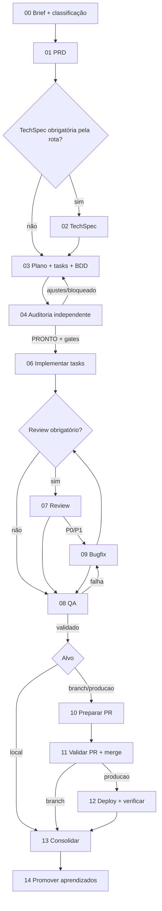

# SDD Template — contratos vivos e SDLC AI-native

Template para desenvolvimento orientado por especificação com agentes de IA,
BDD, Compozy, gates verificáveis e contratos vivos.

A proposta é simples:

```text
intenção
→ especificação
→ plano aprovado
→ implementação
→ review
→ QA
→ PR/merge
→ deploy/verificação
→ contrato vivo
→ aprendizados e evals
```

O fluxo reduz duas falhas comuns de desenvolvimento com agentes:

1. implementar rapidamente a coisa errada;
2. criar muita documentação que não controla nem prova a execução.

Cada artefato existe para reduzir ambiguidade, limitar autoridade, disparar uma
etapa ou guardar evidência.

## O que mudou nesta versão

A evolução AI-native adiciona:

- classificação independente de **rigor**, **risco**, **autonomia** e **alvo do
  contrato**;
- `execucao.md` como plano persistido, com base SHA, arquivos esperados, ordem,
  riscos, alternativas e provas;
- separação entre **parecer do agente** e **gate humano**;
- estado macro (`status`) e fase operacional (`fase`);
- PR, merge, deploy e verificação dentro do ciclo;
- policies/hooks para enforcement determinístico;
- evals do próprio harness;
- promoção de incidentes e retrabalho para regras, skills, runbooks ou evals;
- contrato vivo consolidado apenas no alvo declarado: local, branch ou produção.

## Núcleo conceitual

### Incremento

A unidade completa da entrega:

```text
brief
+ PRD
+ TechSpec
+ plano/tasks
+ impactos contratuais
+ auditoria
+ implementação
+ review/QA
+ PR/merge/deploy
+ fechamento
+ aprendizados
```

### Contrato vivo

`sdd/contratos/[dominio]/contrato.md` descreve o comportamento consolidado.

O contrato não é plano futuro nem documentação de implementação. Durante a
entrega, a mudança fica em:

```text
sdd/incrementos/[feature]/impacto-contratual/[dominio]/contrato.md
```

Somente o passo `13` aplica `NOVO`, `ALTERADO` ou `REMOVIDO` ao contrato vivo.

### Plano de execução

`sdd/incrementos/[feature]/execucao.md` é o equivalente ao plano aceito da
entrega. Ele registra:

- base ref/SHA;
- ordem das tasks;
- arquivos e superfícies esperadas;
- contratos/dados;
- riscos e sinais de parada;
- alternativas descartadas;
- provas de conclusão;
- parecer do agente e gate humano;
- revisões do plano.

Um desvio material exige atualizar o plano e reauditar antes de continuar.

## Dimensões de governança

| Dimensão | Valores | Responde |
| --- | --- | --- |
| Rigor | `small`, `medium`, `large` | Quanto especificar |
| Risco | `baixo`, `medio`, `alto`, `regulado` | Quanto pode dar errado |
| Autonomia | `assistido`, `autonomo_ate_pr`, `autonomo_ate_staging`, `producao_com_gate` | Até onde o agente pode ir |
| Alvo | `local`, `branch`, `producao` | Quando o contrato vivo pode ser consolidado |

Uma mudança pequena em autorização pode ser:

```yaml
rigor: small
risco: alto
autonomia: assistido
alvo_contrato: branch
```

Uma feature interna grande e reversível pode ser:

```yaml
rigor: large
risco: baixo
autonomia: autonomo_ate_pr
alvo_contrato: branch
```

## Fluxo


```mermaid
flowchart TD
    A[00 Brief + classificação] --> B[01 PRD]
    B --> C{TechSpec obrigatória pela rota?}
    C -->|não| D[03 Plano + tasks + BDD]
    C -->|sim| E[02 TechSpec]
    E --> D
    D --> F[04 Auditoria independente]
    F -->|ajustes/bloqueado| D
    F -->|PRONTO + gates| G[06 Implementar tasks]
    G --> H{Review obrigatório?}
    H -->|sim| R[07 Review]
    H -->|não| I[08 QA]
    R -->|P0/P1| J[09 Bugfix]
    R --> I
    I -->|falha| J
    J --> H
    J --> I
    I -->|validado| K{Alvo}
    K -->|local| N[13 Consolidar]
    K -->|branch/producao| L[10 Preparar PR]
    L --> M[11 Validar PR + merge]
    M -->|branch| N
    M -->|producao| O[12 Deploy + verificar]
    O --> N
    N --> P[14 Promover aprendizados]
```

O passo `05` é bootstrap/atualização da governança e não roda obrigatoriamente
em cada incremento.

## Passos

| Passo | Objetivo |
| --- | --- |
| `00` | Abrir incremento e classificar rigor, risco, autonomia e alvo |
| `01` | Criar PRD observável |
| `02` | Criar TechSpec e ADRs |
| `03` | Criar plano, tasks, BDD e impactos contratuais |
| `04` | Auditar especificação e plano em contexto isolado |
| `05` | Instalar rules, skills, policies, hooks e evals |
| `06` | Executar task dentro do plano aprovado |
| `07` | Revisar implementação em contexto isolado |
| `08` | Executar QA como consumidor |
| `09` | Corrigir causa raiz e criar regressão |
| `10` | Preparar pacote, commits e PR conforme autoridade |
| `11` | Validar checks/reviews e gate de merge |
| `12` | Fazer deploy, health checks e rollback se necessário |
| `13` | Consolidar contrato vivo e arquivar incremento |
| `14` | Promover aprendizados para harness e operação |

## Estados

```text
status:
proposto → especificado → em_execucao → validado → consolidado
                         ↘ bloqueado ↗

fase:
triagem → especificacao → planejamento → auditoria → implementacao
→ review → qa → validacao → pr → merge → deploy → verificacao → fechamento → aprendizado
```

`validado` ainda não significa merged ou deployed.

## Estrutura no projeto alvo

```text
sdd/
  contratos/
  incrementos/
  historico/
  aprendizados/
  metricas.csv                  # série de indicadores por incremento
  governanca/
    policies.yaml               # caminhos protegidos, segredos, autoridade
    sdd-guard.sh                # gates + protect + scan-secrets
    sdd-fluxo.sh                # driver do loop (próximo passo)
    sdd-metricas.sh             # indicadores leading/lagging
    sdd-hook-claude.sh          # hook PreToolUse
    sdd-watch.sh.example        # detector operacional (copiar e ajustar)
    watch.yaml.example
  evals/
    README.md
    run-evals.sh                # tier 1 determinístico + tier 2 agêntico
    cases/core-contracts.yaml
  prompts/
    _comum.md
    00-*.md ... 14-*.md

.claude/
  settings.json                 # hooks do guard (gerado pelo instalador)

.github/workflows/
  sdd-guard.yml                 # evals + segredos + caminhos protegidos no PR
  sdd-watch.yml                 # opcional: loop operacional agendado

.compozy/
  config.toml
  tasks/
    [feature]/
      _prd.md
      _techspec.md
      INDEX.md
      task_NN.md
      feature/
      adrs/
      reviews-001/
      qa/
      pr/
      ops/
```

## Instalação

Dentro do projeto:

```bash
curl -fsSL https://raw.githubusercontent.com/cezaraf/sdd-template/main/install.sh | bash
```

Opções:

```bash
# escopo
curl -fsSL .../install.sh | bash -s -- --global
curl -fsSL .../install.sh | bash -s -- --project /caminho/do/repo

# ferramentas e Compozy
curl -fsSL .../install.sh | bash -s -- --tools claude,codex,opencode
curl -fsSL .../install.sh | bash -s -- --skip-compozy

# versão, simulação e remoção
curl -fsSL .../install.sh | bash -s -- --ref v2
curl -fsSL .../install.sh | bash -s -- --dry-run
curl -fsSL .../install.sh | bash -s -- --uninstall
```

O instalador:

- copia prompts `00`–`14` e `_comum.md`;
- gera skills/commands para Claude Code, Codex e OpenCode;
- registra auditor, revisor e QA como agents isolados;
- cria estrutura SDD e Compozy;
- instala templates de policies, guard e evals sem sobrescrever customizações;
- instala o Compozy quando possível.

## Comandos

O prefixo padrão é `cz`:

```text
/cz-iniciar-incremento
/cz-criar-prd
/cz-criar-techspec
/cz-criar-tasks
/cz-auditar-especificacao
/cz-instalar-rules-skills
/cz-executar-task
/cz-revisar-implementacao
/cz-executar-qa
/cz-corrigir-bugs
/cz-preparar-pr
/cz-validar-pr-merge
/cz-deploy-verificar
/cz-consolidar-contrato-vivo
/cz-promover-aprendizados
```

No Codex, use `$cz-...` ou o menu de skills.

### Sessão típica `small`, risco baixo, alvo branch

```text
/cz-iniciar-incremento filtrar tarefas por status
/cz-criar-prd filtrar-tarefas-por-status
/cz-criar-tasks filtrar-tarefas-por-status
/cz-auditar-especificacao filtrar-tarefas-por-status
/cz-executar-task filtrar-tarefas-por-status task_01
/cz-revisar-implementacao filtrar-tarefas-por-status
/cz-executar-qa filtrar-tarefas-por-status
/cz-preparar-pr filtrar-tarefas-por-status
/cz-validar-pr-merge filtrar-tarefas-por-status
/cz-consolidar-contrato-vivo filtrar-tarefas-por-status
/cz-promover-aprendizados filtrar-tarefas-por-status
```

## Agents isolados

| Agent | Passo | Resultado |
| --- | --- | --- |
| `cz-auditor-especificacao` | 04 | auditoria e parecer |
| `cz-revisor-implementacao` | 07 | review-report e issues |
| `cz-qa` | 08 | QA e bugs reproduzíveis |

Eles não devem herdar o viés da sessão que implementou.

## Loop do fluxo

O próximo passo não depende de memória: o driver lê o estado do incremento,
consulta os gates e responde o que fazer.

```bash
sdd/governanca/sdd-fluxo.sh [feature]         # próximo passo autorizado
sdd/governanca/sdd-fluxo.sh [feature] --run   # aplica transições determinísticas
sdd/governanca/sdd-fluxo.sh [feature] --json  # para automação
```

`--run` só avança `proposto → especificado` após `pre-specify` e
`em_execucao → validado` após `pre-validate`. Nunca aprova gate humano, nunca
faz commit, push, merge ou deploy. A saída só propõe uma transição quando o
mesmo guard que será usado no `--run` já a considera válida.

## Governança determinística

Prompts orientam; hooks e CI bloqueiam.

```bash
sdd/governanca/sdd-guard.sh validate-policy
sdd/governanca/sdd-guard.sh pre-specify [feature]
sdd/governanca/sdd-guard.sh pre-implement [feature] task_NN
sdd/governanca/sdd-guard.sh pre-complete [feature] task_NN
sdd/governanca/sdd-guard.sh pre-validate [feature]
sdd/governanca/sdd-guard.sh pre-merge [feature]
sdd/governanca/sdd-guard.sh pre-production [feature]
sdd/governanca/sdd-guard.sh pre-consolidate [feature]
sdd/governanca/sdd-guard.sh protect <caminho>       # usado pelo hook
sdd/governanca/sdd-guard.sh protect-ci <caminho>    # autoridade externa no CI
sdd/governanca/sdd-guard.sh scan-secrets <arquivos> # usado pelo CI
```

O instalador registra `sdd-hook-claude.sh` como hook `PreToolUse` no
`.claude/settings.json`. `Write`, `Edit`, `MultiEdit` e `NotebookEdit` passam
por proteção de path e scan do conteúdo; Bash mutante é analisado e falha
fechado quando o destino não pode ser determinado com segurança.

O YAML registra aprovações, mas não é fonte de autoridade. Configure em
`sdd/governanca/policies.yaml` um `authority.check_command` absoluto, fora do
worktree, e fixe seu digest lowercase em `authority.check_sha256`. O checker
recebe `SDD_AUTH_FEATURE`, `SDD_AUTH_GATE`, `SDD_AUTH_HEAD` e `SDD_AUTH_TARGET`;
somente exit `0` com SHA-256 íntegro comprova a decisão. Sem checker, gates
humanos e dispensas de qualidade permanecem bloqueados.

Preencha também `quality_commands` com lint, typecheck, build, testes e E2E
reais. Listas vazias exigem waiver externo, nunca significam verde. O workflow
`.github/workflows/sdd-guard.yml` aplica os mesmos controles ao diff; mudanças
de contrato usam `protect-ci` porque o atestado local não é transportado ao CI.
O workflow extrai a policy do commit base para `SDD_TRUSTED_POLICIES`: um PR não
pode trocar seu próprio checker por um comando permissivo. O bootstrap inicial,
sem policy na base, requer aprovação administrativa fora desse workflow.

`pre-consolidate` emite em `.git/sdd-state` um atestado curto, ligado ao `HEAD`
e aos domínios de `impacto-contratual/`. `status: validado` e
`fase: fechamento` sozinhos não abrem mais `sdd/contratos/`.

## Métricas

Cada passo registra seu marco no bloco `metricas:` do `incremento.yaml`; o
fechamento consolida a série.

```bash
sdd/governanca/sdd-metricas.sh [feature]                     # relatório markdown
sdd/governanca/sdd-metricas.sh [feature] --marcar data_merge # registra marco
sdd/governanca/sdd-metricas.sh [feature] --csv               # upsert em sdd/metricas.csv
sdd/governanca/sdd-metricas.sh [feature] --atualizar-relatorio
```

Leading: triagem→especificado, primeira task→validado, validado→merge, lead
time total. Lagging: reauditorias, revisões do plano, issues de review, bugs,
`P0`/`P1` abertos e aderência ao plano (diff real contra os arquivos previstos
em `execucao.md`). Aumento de autonomia exige série histórica, não impressão.

## Operação e incidentes

```bash
cp sdd/governanca/sdd-watch.sh.example sdd/governanca/sdd-watch.sh
cp sdd/governanca/watch.yaml.example sdd/governanca/watch.yaml
sdd/governanca/sdd-watch.sh
```

A detecção é determinística (baseline histórico e bandas 1σ/2σ/3σ, sem LLM):
1σ registra, 2σ chama o agente apenas para diagnóstico somente-leitura e 3σ
aciona runbook pré-aprovado/incident response. Exit `4` significa erro de
configuração, coleta ou persistência e falha o job. O workflow restaura e salva
o baseline entre execuções. O incidente entra no fluxo pela rota `incidente` do
passo `00` e vira incremento.

## Evals do harness

```bash
sdd/evals/run-evals.sh --tier1   # determinístico, roda em CI
SDD_EVAL_AGENT="claude -p" \
SDD_EVAL_JUDGE="claude -p" \
  sdd/evals/run-evals.sh --all   # executor e oracle em contextos separados
```

`--all` sem executor/judge termina não zero. Evidência não vazia não é PASS: o
judge precisa emitir um verdict JSON estruturado e consistente com os critérios.

Os casos em `sdd/evals/` verificam invariantes do processo, como:

- segurança não ser classificada como risco baixo;
- implementação não iniciar sem auditoria;
- contrato vivo não mudar antes do passo 13;
- QA não marcar como aprovado o que não executou;
- P0/P1 bloquear merge/deploy;
- bugfix criar regressão;
- produção exigir gate humano.

Ao alterar prompts, rules, skills, agents, model routing ou hooks, rode as evals.
O tier 1 é validado por mutação: quando uma checagem do guard é desativada de
propósito, a suíte fica vermelha.

## Migração da versão anterior

A etapa de consolidação, antes numerada como passo 10, foi movida para
`13-consolidar-contrato-vivo.md`. O nome do comando continua:

```text
cz-consolidar-contrato-vivo
```

Novos incrementos devem incluir os campos:

```yaml
status: proposto
fase: triagem
classificacao:
  rigor: medium
  risco: medio
  autonomia: assistido
  alvo_contrato: branch
```

Projetos com `policies.yaml` version 1 não recebem o guard novo silenciosamente.
O instalador termina como `INCOMPLETA` e gera `policies.yaml.v2.example` para
migração explícita, preservando a configuração existente.

Incrementos antigos podem ser migrados de forma incremental. Não reescreva
histórico consolidado.

## Regras de ouro

1. Contrato vivo só muda no passo `13`.
2. Implementação só começa com auditoria pronta e gates aplicáveis.
3. Todo comportamento rastreia até cenário, teste e evidência.
4. Desvio material do plano exige revisão e reauditoria.
5. Parecer do agente não substitui gate humano.
6. Produção sempre exige autorização específica.
7. Incidentes e retrabalho recorrente viram eval, policy, skill ou runbook.
8. Sem commit, push, PR, merge ou deploy fora da autoridade registrada.

Mais detalhes em [`docs/ai-native-sdlc.md`](docs/ai-native-sdlc.md).
